# 🛒 Motorcycle Sales SQL Analytics Case Study  
**Analyzing Sales, Profitability & Customer Behavior Using PostgreSQL**

---

## 📌 Project Overview
This SQL analytics case study explores a **motorcycle accessories and parts sales dataset**, focusing on understanding **revenue trends, profitability, operational efficiency, and customer behavior** using SQL.

The goal is to derive **business insights using SQL**, particularly around:

✔ Growth & seasonal trends  
✔ Profitability & ROI  
✔ Customer segmentation  
✔ Operational efficiency  

---

## 🎯 Project Objectives

| Objective | Description |
|-----------|-------------|
| 🧹 Data Cleaning & Preparation | Cleaning dates, missing values, duplicate handling |
| 📊 Exploratory Data Analysis | Understanding data quality, distribution, and structure |
| 📈 Performance & Growth Analysis | Discovering trends, seasonality, and regional performance |
| 💰 Profitability Optimization | Identifying loss leaders, ROI, and margin analysis |
| 👤 Customer Behavior Analysis | Segmentation by age, gender, location, and ratings |

---

## 📂 Dataset Description

| Column Name | Description |
|-------------|-------------|
| `date`, `month`, `year` | Purchase timestamp |
| `time` | Order time |
| `customer_age`, `customer_gender` | Customer demographics |
| `country`, `state` | Customer location |
| `product_category`, `sub_category` | Product classification |
| `quantity`, `unit_cost` | Quantity and unit cost |
| `revenue`, `profit`, `profit_margin` | Business metrics |
| `payment`, `rating` | Payment mode & customer satisfaction |

---

## 🏛 Database Schema

```sql
motorcycle_sales (
  date DATE,
  time TIME,
  customer_age INT,
  customer_gender VARCHAR,
  country VARCHAR,
  state VARCHAR,
  product_category VARCHAR,
  sub_category VARCHAR,
  quantity INT,
  unit_cost NUMERIC,
  revenue NUMERIC,
  profit NUMERIC,
  profit_margin NUMERIC,
  payment VARCHAR,
  rating NUMERIC
)
```
## Basic EDA (Exploratory Data Analysis)

``select * 
from motorcycle_sales limit 10;``


----------------------------------
**total rows**

```SELECT 
    COUNT(*) AS total_rows
FROM motorcycle_sales;
```
   

---------------------------------
**total columns**

```SELECT 
    COUNT(*) AS total_columns
FROM information_schema.columns
WHERE table_name = 'motorcycle_sales';
```

**Summary statistics (Min, Max, Avg, Median revenue & profit)**

```
SELECT
    ROUND(AVG(CAST(revenue AS NUMERIC)),2) AS avg_revenue,
    MIN(CAST(revenue AS NUMERIC)) AS min_revenue,
    MAX(CAST(revenue AS NUMERIC)) AS max_revenue,
    ROUND(CAST(PERCENTILE_CONT(0.5) WITHIN GROUP (ORDER BY CAST(revenue AS NUMERIC)) AS NUMERIC),2) AS median_revenue,
    ROUND(AVG(CAST(gross_profit AS NUMERIC)),2) AS avg_profit,
    MIN(CAST(gross_profit AS NUMERIC)) AS min_profit,
    MAX(CAST(gross_profit AS NUMERIC)) AS max_profit
FROM motorcycle_sales;
```
-------------------------------------------------------------------
**gender distribution**

```
SELECT 
    customer_gender,
    COUNT(*) AS total_transactions
FROM motorcycle_sales
GROUP BY customer_gender
ORDER BY total_transactions DESC;
```

**payment method distribution**

```
SELECT
    payment,
    COUNT(*) AS total_orders,
    ROUND(SUM(revenue),2) AS total_revenue
FROM motorcycle_sales
GROUP BY payment
ORDER BY total_orders DESC;
```

## Business Problems and Solutions

### -- PHASE -1 📈 [Performance & Growth Analysis]

**1.Which product categories show **consistent revenue growth** over time (YoY / MoM)?**

```with cte as 
(select  month,
        sum(revenue) as total_revenue
from motorcycle_sales
group by month)
select month,
       total_revenue,
	   lag(total_revenue) over(order by month) as prev_month_rev,
	    ROUND(
        ((total_revenue - LAG(total_revenue) OVER (ORDER BY month)) 
        / NULLIF(LAG(total_revenue) OVER (ORDER BY month), 0)) * 100, 2
    ) AS revenue_growth_pct
from cte;
```

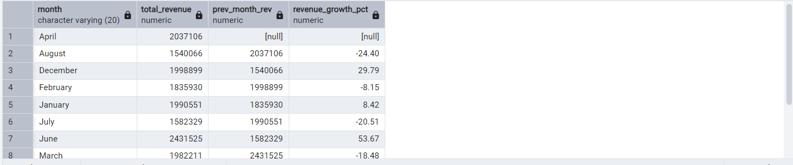

-----------------------------------------

```WITH cte AS (
    SELECT 
        year,
        product_category,
        SUM(revenue) AS total_revenue
    FROM motorcycle_sales
    GROUP BY product_category, year
)
SELECT 
    product_category,
    year,
    total_revenue,
    LAG(total_revenue) OVER(PARTITION BY product_category ORDER BY year) AS prev_year_value,
    ROUND(
        (
            (total_revenue - LAG(total_revenue) OVER(PARTITION BY product_category ORDER BY year))
            / NULLIF(LAG(total_revenue) OVER(PARTITION BY product_category ORDER BY year), 0)
        ) * 100
    , 2) AS yoy_growth_pct
FROM cte;
```
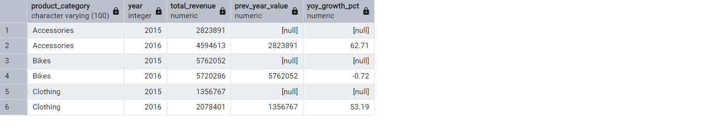

**2.Which states are **emerging markets** (high growth % but low total sales)?**

```
WITH state_monthly AS (
    SELECT 
        state,
        month,
        SUM(revenue) AS revenue
    FROM motorcycle_sales
    GROUP BY state, month
),

state_growth AS (
    SELECT 
        state,
        month,
        revenue,
        LAG(revenue) OVER (
            PARTITION BY state 
            ORDER BY TO_DATE(month, 'Month')
        ) AS prev_month_revenue
    FROM state_monthly
),

state_stat AS (
    SELECT 
        state,
        AVG(revenue) AS avg_revenue,
        AVG(
            ROUND(
                ((revenue - prev_month_revenue) / NULLIF(prev_month_revenue, 0)) * 100, 2
            )
        ) AS avg_mom_growth_pct
    FROM state_growth
    WHERE prev_month_revenue IS NOT NULL
    GROUP BY state
)

SELECT
    state,
    ROUND(avg_revenue, 2) AS avg_monthly_revenue,
    ROUND(avg_mom_growth_pct, 2) AS avg_mom_growth_pct
FROM state_stat
WHERE avg_revenue < 5000          -- Low revenue
  AND avg_mom_growth_pct > 10     -- High growth %
ORDER BY avg_mom_growth_pct DESC;
```
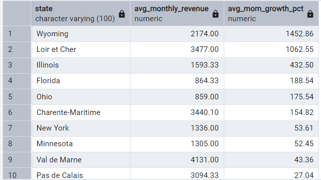

**3.Which product subcategories show **declining demand**, and in which regions?**
``` 
with cte as 
(select state,
       sub_category,
	   month,
	   sum(revenue) as revenue_monthly
from motorcycle_sales
GROUP BY state, sub_category, month),
cte2 as 
(select state,
       sub_category,
	   month,
	   revenue_monthly,
	   lag(revenue_monthly) over(partition by state, sub_category order by month) as prv_month_revenue
from cte)
select state,
       sub_category,
	   month,
	   revenue_monthly,
	   prv_month_revenue,
	   round(
	   (revenue_monthly - prv_month_revenue)
	   /nullif(prv_month_revenue,0)*100,2) as growth_pct,
	   case when revenue_monthly < prv_month_revenue then 'Decline'
	   else 'growing'
	    END AS demand_trend
from cte2
ORDER BY demand_trend DESC, state, sub_category, month;
```
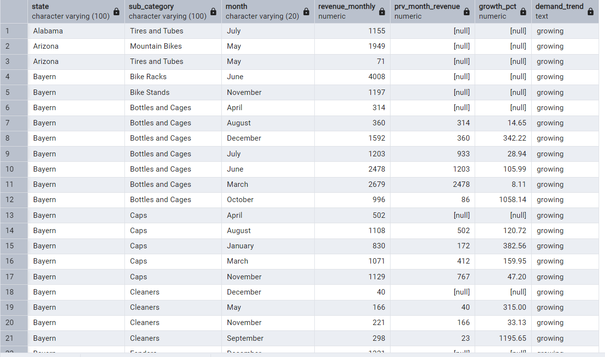

**4.Which **seasonal trends** impact sales (Spring riding season? Holiday spikes)?**     

 --**Month-wise Revenue Trend (Seasonal Pattern)**
```
select month,
       sum(revenue) as sales,
	   round(avg(revenue),2) as avg_ord_value
from motorcycle_sales
group by month
order by TO_DATE(month, 'Month');
```
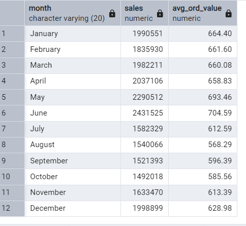
----------------------------------------------------
**Quarter-wise Revenue Trends (Seasonal Business View)**
```
select quarter,
       sum(revenue) as sales,
	   round(avg(revenue),2) as avg_ord_value
from motorcycle_sales
group by quarter
order by quarter;
```


-------------------------------------------------------

                         -- Month + Category Seasonal Demand
```
select month,
       product_category,
       sum(revenue) as sales,
	   round(avg(revenue),2) as avg_ord_value
from motorcycle_sales
group by month,product_category
order by TO_DATE(month, 'Month'),sales desc;
```
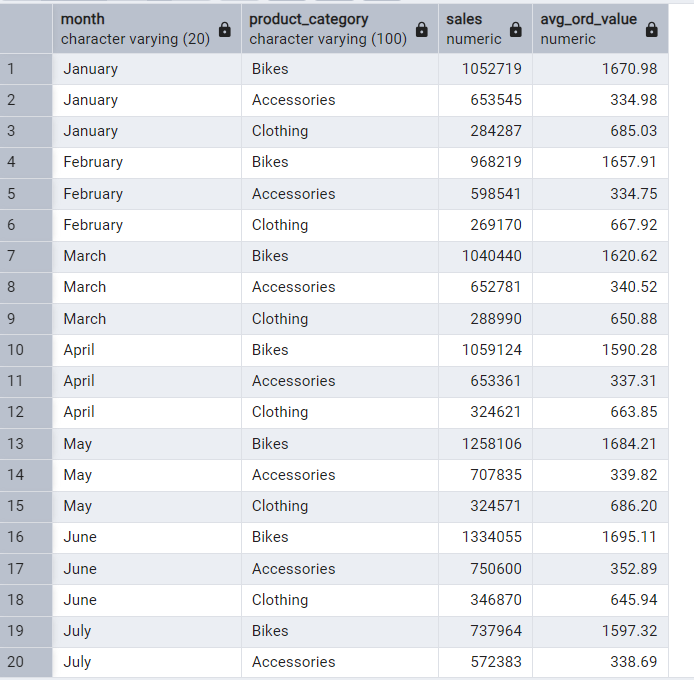

**5.What is the **time-based revenue contribution** (Weekend vs Weekday, peak hours)?**

**Weekend vs Weekday**

```
select  
        case when trim(day_of_week) in ('Saturday', 'Sunday') then 'Weekend'
		else 'Weekday'
		end as day_type,
		sum(revenue) as sales,
		round(avg(revenue),2) as avg_ord_value
from motorcycle_sales
group by day_type;
```

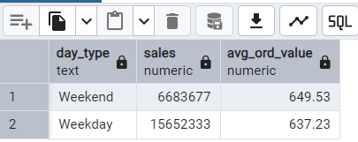
------------------------------------
**peak hours**
```
SELECT
    EXTRACT(HOUR FROM time) AS hour_of_day,
    COUNT(*) AS total_orders,
    SUM(revenue) AS total_revenue,
    ROUND(AVG(revenue), 2) AS avg_order_value
FROM motorcycle_sales
GROUP BY hour_of_day
ORDER BY total_revenue DESC;
```
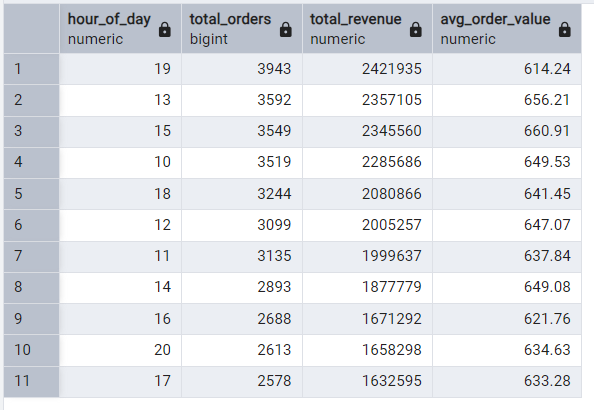

## 📈 Phase 1 — Performance & Growth Analysis (Summary)

### 🗓️ Seasonal & Monthly Trends
Sales are highest during April to June, especially in June, indicating peak riding and outdoor gear season. Sales drop notably in August and September, suggesting an off-season. December also shows a holiday-driven revenue boost.

### 📂 Category Growth Insights
Accessories and Clothing show strong year-over-year growth, making them the most promising categories. Bike sales remain steady but show signs of stagnation or market maturity.

### 🗺️ Emerging Market Regions
States like Wyoming, Illinois, Loir et Cher, and Ohio have low current revenue but very high growth rates, making them strong candidates for regional expansion, localized campaigns, and dealership opportunities.

### 🕒 Best Time to Sell
Evenings (6–9 PM) drive the highest purchase volume, while afternoon hours (1–3 PM) have the highest average order value, indicating premium and planned purchases. This suggests ideal ad timing and promotion windows.

### 📆 Weekday vs Weekend Buying Behavior
Weekdays generate more total sales volume, while weekends result in higher-value purchases. This indicates that regular shopping happens through the week, while premium and leisure shopping happens on weekends.

### 📊 Quarter-Wise Performance
Q2 (April–June) is the strongest quarter for both sales and average order values. Q3 (July–September) is the weakest, indicating the need for targeted discounting or promotions during that period.

---

### 📝 Final Business Takeaways (Phase 1)

- Focus marketing and inventory planning heavily in April–June.
- Promote and bundle high-growth categories like Accessories and Clothing.
- Expand into growth markets such as Wyoming and Illinois.
- Run premium product ads on weekends and during 1–3 PM and 6–9 PM.
- Q2 is the strategic quarter for scaling operations, promotions, and profit optimization.


                                             ----------------------------------
                                                        -- Phase - 2
                                             ----------------------------------
**6.Which products generate **high revenue but low profit margin** (loss leaders)?**   
```
WITH revenue_stats AS (
    SELECT 
        ROUND(AVG(revenue),2) AS avg_revenue
    FROM motorcycle_sales
)
SELECT 
    sub_category,
    SUM(revenue) AS total_revenue,
    SUM(gross_profit) AS total_profit,
    ROUND(AVG(profit_margin),2) AS avg_profit_margin
FROM motorcycle_sales, revenue_stats
GROUP BY sub_category, avg_revenue
HAVING 
    SUM(revenue) > avg_revenue      -- High revenue (business benchmark)
    AND AVG(profit_margin) < 20     -- Low profit margin 
ORDER BY avg_profit_margin ASC, total_revenue DESC;
```
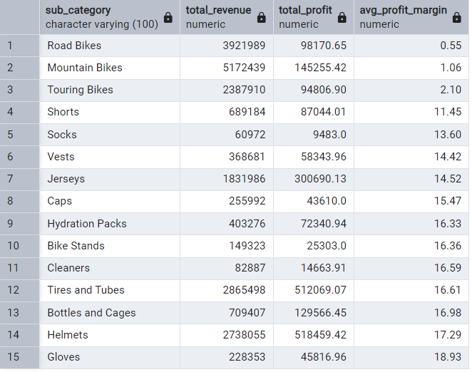

**7.Which warehouses have the **highest operational inefficiency** (low profit despite high sales)?**	
        
```
WITH warehouse_stats AS (
    SELECT
        state,
        SUM(revenue) AS total_revenue,
        SUM(gross_profit) AS total_profit,
        ROUND((SUM(gross_profit) / NULLIF(SUM(revenue), 0)) * 100, 2) AS profit_margin_pct
    FROM motorcycle_sales
    GROUP BY state
),

thresholds AS (
    SELECT
        ROUND(AVG(total_revenue), 2) AS avg_revenue,
        ROUND(AVG(profit_margin_pct), 2) AS avg_profit_margin
    FROM warehouse_stats
)

SELECT 
    w.state,
    w.total_revenue,
    w.total_profit,
    w.profit_margin_pct,
    CASE
        WHEN w.total_revenue > t.avg_revenue
         AND w.profit_margin_pct < t.avg_profit_margin
        THEN 'Operationally Inefficient'
        ELSE 'Efficient/Normal'
    END AS efficiency_status
FROM warehouse_stats w
JOIN thresholds t ON TRUE
ORDER BY w.profit_margin_pct ASC, w.total_revenue DESC;
```
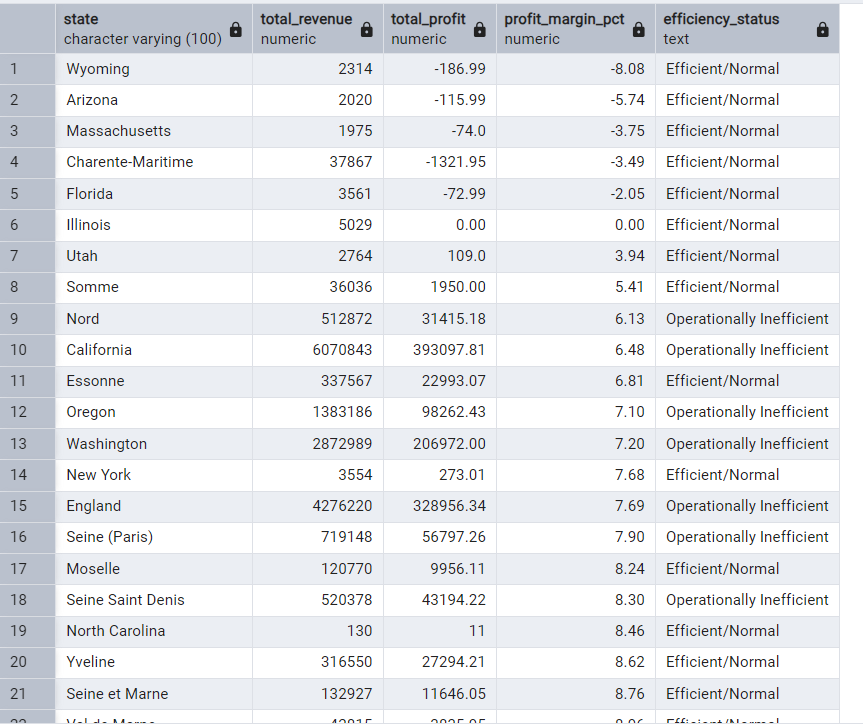

**8.Which payment methods are **associated with lower returns and higher ratings**?**
``` 
select payment,
       round(sum(revenue),2) as sales,
	   round(avg(rating),2) as avg_rating
from motorcycle_sales
group by 1
order by 3 desc;
```
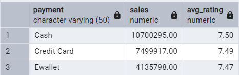

**9.What is the **discount vs revenue relationship**? Is discounting effective or harmful?** 
                                
								------ correlation -------
                                --------------------------
```
SELECT 
      CORR(profit_margin, revenue) AS margin_revenue_corr
FROM motorcycle_sales;
```
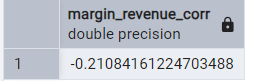
-------------------------------------------------------------------------------------------------
        ---------------------Find Loss Leader Products (high revenue, low profit margin)-----
		-----------------------------------------------------------------------------------------
```
select sub_category,
       round(sum(revenue),2) as sales,
	   round(sum(gross_profit),2) as total_pofit,
	   round(avg(profit_margin),2) as avg_profit_margin
from motorcycle_sales
group by 1
having avg(profit_margin) < 15
and sum(revenue) > (select avg(revenue) from motorcycle_sales)
order by avg_profit_margin asc;
```
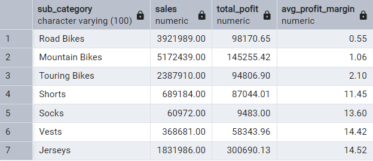

-------------------------------------------------------------------------------------------------
        ---------------------Does low profit margin hurt or improve customer satisfaction?-----
		-----------------------------------------------------------------------------------------
```
SELECT 
    sub_category,
    ROUND(AVG(profit_margin),2) AS avg_profit_margin,
    ROUND(AVG(rating),2) AS avg_rating
FROM motorcycle_sales
GROUP BY sub_category
ORDER BY avg_rating DESC;
```
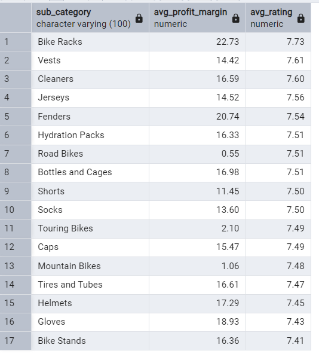

**10. What is the **ROI per category**, after considering cost, returns, and discount impact?**

```
select product_category,
        sum(revenue) as total_revenue,
       sum(gross_profit) as total_profit,
	   sum(total_cost) as total_cost,
      round((sum(gross_profit) / nullif(sum(total_cost),0)) *100,2) as roi_pct
from motorcycle_sales
group by 1
order by roi_pct desc;
```
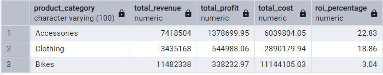

## 💰 Phase 2 — Profitability & Cost Optimization (Summary)

### 🛑 Loss Leaders (High Sales, Low Profit)
Road Bikes, Mountain Bikes, and Touring Bikes generate very high revenue but have extremely low profit margins (<2%). These products attract customers but bring little profit — making them loss leaders. They are useful for customer acquisition but not ideal for long-term profitability.

---

### 🏭 Operational Efficiency by State
States like California, Oregon, Washington, and England show high revenue but relatively lower profit performance, indicating operational inefficiencies. These regions require cost control, better logistics, or pricing optimization.

Low-revenue states with negative or low profit (Wyoming, Arizona, Florida) are less efficient but also in early-market development — not yet a priority for cost optimization.

---

### 💳 Payment Methods & Satisfaction
Cash payments dominate revenue and slightly lead in customer satisfaction scores. However, Credit Card and E-wallet payments show nearly equal ratings, making them strong alternatives. Digital payments lead to smoother transactions and better customer experience but are not yet optimized.

---

### 📉 Discount / Profitability Relationship
Correlation between discount (approximated through low profit margin) and revenue is weak (-0.21). This suggests that **higher discounts do not significantly increase sales** and may even harm profit margins. Discounting strategy needs to be more targeted.

---

### 📦 Profitability Leaders vs. Customer Sentiment
Categories like Bike Racks, Fenders, Helmets, Gloves, and Jackets offer both strong profit margins and high customer ratings — ideal for premium promotion. Meanwhile, high-selling bike categories receive average ratings despite lower profitability, indicating customers view them as essentials rather than premium products.

---

### 📊 ROI by Category
Accessories deliver the **highest ROI (~23%)**, followed by Clothing (~19%). Bikes have the **lowest ROI (~3%)**, despite high sales volume. This confirms that Bikes are more of an acquisition product than a profit driver.

---

### 📝 Final Strategic Takeaways — Phase 2
- Promote **Accessories & Riding Gear** — high profit, high satisfaction, high ROI.
- Use **Bikes as strategic lead products**, but shift focus to profitable upsell items.
- Eliminate blanket discounting — it hurts profits without meaningful sales growth.
- Focus cost-optimization efforts in states with good revenue but poor margins.
- Bundle Bikes with high-margin accessories (helmets, gloves, racks) to improve profitability.


----------------------------------------------------------------------
                                       -- Phase-3 [Customer Behavior & Segmentation]


**11.Do older customers (30+) spend more on safety gear compared to younger buyers?**     
```
select 
       case when customer_age < 30 then 'Younger (<30)'
	   else 'Older (<40+)'
	   end as age_group,
	   sum(revenue) as total_safety_gear_spending,
	   round(avg(revenue),2) as avg_ord_value
from motorcycle_sales
where sub_category in ('Helmets','Gloves','Vests','caps')
group by age_group
order by total_safety_gear_spending desc;
```
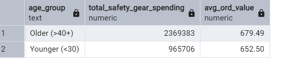
**12.Which customer segment (Age × Gender × Location) generates **highest revenue per order**?** 
```
select 
       case 
	       when customer_age between 18 and 25 then 'Younger(18-25)'
	       when customer_age between 26 and 39 then 'Adult(26-39)'
	       when customer_age between 40 and 55 then 'Mature(40-55)'
		   else 'Older(55+)'
		   end as age_group,
		   customer_gender as gender,
		   state,
		   round(avg(revenue),2) as avg_revenue_per_order,
		   count(*) as total_orders,
		   sum(revenue) as sales
from motorcycle_sales
group by age_group,gender,state
order by avg_revenue_per_order desc , sales desc;
```
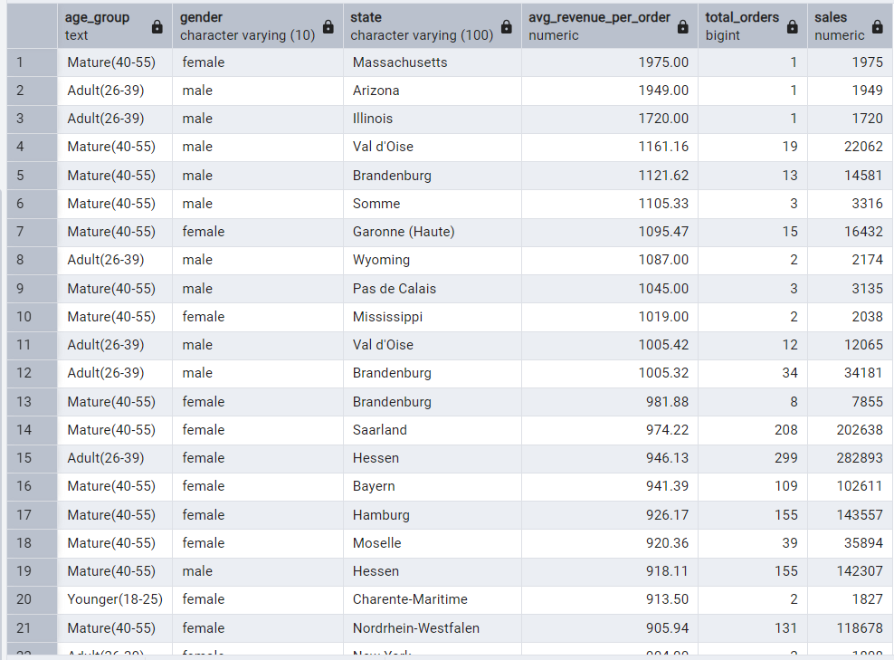
**13.Which group gives **higher product ratings**?**
```
select 
       case 
	       when customer_age between 18 and 25 then 'Younger(18-25)'
	       when customer_age between 26 and 39 then 'Adult(26-39)'
	       when customer_age between 40 and 55 then 'Mature(40-55)'
		   else 'Older(55+)'
		   end as age_group,
		   round(avg(rating),2) as avg_rating
from motorcycle_sales
group by age_group
order by avg_rating desc
```
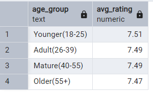

## 👤 Phase 3 — Customer Behavior & Segmentation (Summary)

### 🦺 Safety Gear Spending — Age Comparison
Older customers (40+) spend significantly more on safety gear such as helmets, gloves, and protective wear. They also have a higher average order value compared to younger buyers. This indicates that mature buyers focus more on safety, quality, and long-term usage rather than just cost.

---

### 🎯 High-Value Customer Segments (Age × Gender × Location)
The highest revenue per order comes from:
- Mature (40–55) and Adult (26–39) age groups  
- Mostly females, followed by males  
- States like Arizona, Illinois, Val d’Oise, Brandenburg, and Mississippi  

These customers prefer premium and mid-to-high range accessories and gear, making them ideal for targeted promotional campaigns and loyalty programs.

---

### ⭐ Customer Satisfaction (By Age Group)
Customer ratings are very similar across all age groups, with slightly higher ratings from customers aged 18–25. This indicates that customer satisfaction is generally consistent, suggesting well-balanced product quality and service experience.

---

### 📝 Final Insights — Phase 3
- Safety-conscious buyers are typically **aged 40+**, with higher spending and stronger purchase intent.
- **Female mature buyers** in certain regions are the best premium customer segment.
- Ratings are **consistently positive** across all age groups, meaning no major demographic dissatisfaction.
- Focus marketing efforts on **mature and adult premium buyers**, especially in high-performing states.


# End OF THIS PROJECT
## Author-MOHAMMAD ADIL